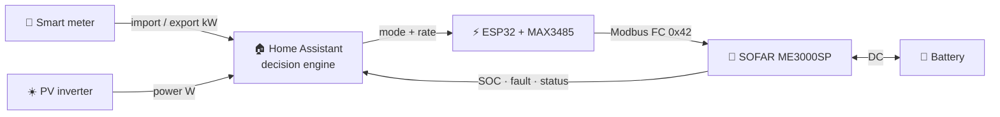

<div align="center">

```text
░█▀▀░█▀█░█▀▀░█▀█░█▀▄░░░█▄█░█▀▀░▀▀█░█▀█░█▀█░█▀█░█▀▀░█▀█
░▀▀█░█░█░█▀▀░█▀█░█▀▄░░░█░█░█▀▀░░▀▄░█░█░█░█░█░█░▀▀█░█▀▀
░▀▀▀░▀▀▀░▀░░░▀░▀░▀░▀░░░▀░▀░▀▀▀░▀▀░░▀▀▀░▀▀▀░▀▀▀░▀▀▀░▀░░
```

# SOFAR ME3000SP Controller

**Smart battery inverter control for Home Assistant**

_Driven by your smart meter + PV inverter. The SOFAR is the actuator, Home Assistant is the brain._

> **Mad Science Lab operating principle:** *"Gissen is missen, gokken is jokken."*  
> Every decision is measured, stored, and reported. The sensors read the store — they never invent their own logic.

[](CHANGELOG.md)
[](https://hacs.xyz/)
[](https://www.home-assistant.io/)
[](docs/ARCHITECTUUR.md)
[](LICENSE)

[](https://github.com/2technology/sofar-me3000sp-homeassistant/actions)
[](https://github.com/2technology/sofar-me3000sp-homeassistant/actions)
[](https://2technology.github.io/sofar-me3000sp-homeassistant/)

</div>

---

## ✨ What makes this different?

| ⚡ External truth | 🧠 Smart decisions | 🔋 Actuator control |
|---|---|---|
| Uses your **smart meter** import/export as the single source of truth — not the SOFAR's internal CT clamps. | Home Assistant decides charge / discharge / auto / standby based on real-time data, PV forecast, and quarter-peak tracking. | Commands go via **ESP32 + MAX3485** over Modbus RS485 to the SOFAR ME3000SP in Passive Mode. |

> ⚠️ **Why external sources?** In many installations the internal CT clamps are unreliable or deliberately repositioned by the installer. This integration sidesteps that entirely.

---

## 📋 Quick start

- [ ] SOFAR ME3000SP set to **Passive Mode** (display menu)
- [ ] Flash the [ESPHome firmware](#esphome-firmware) on an ESP32 + MAX3485
- [ ] Add this repo to **HACS → Custom repositories**
- [ ] Install **SOFAR ME3000SP Controller** and restart HA
- [ ] Run the setup wizard and pick your smart meter, PV, and SOFAR entities
- [ ] Optionally add [Solcast forecast entities](#forecast-aware-decisions-optional) for smarter decisions
- [ ] Open the **Control Center** dashboard and pick a strategy

Done. No YAML required.

---

## 🗺️ How it works




1. **Smart meter** reports import/export
2. **PV inverter** reports production
3. **Home Assistant** runs the decision engine
4. **ESP32 + MAX3485** sends Modbus commands
5. **SOFAR ME3000SP** executes and reports back

---

## 🚀 Install via HACS (recommended)

1. Make sure [HACS](https://hacs.xyz/) is installed
2. **HACS → Integrations → ⋮ → Custom repositories**, add:
   ```text
   https://github.com/2technology/sofar-me3000sp-homeassistant
   ```
   type: **Integration**
3. Search **SOFAR ME3000SP Controller** → **Download**
4. Restart Home Assistant
5. **Settings → Devices & Services → Add Integration** → "SOFAR ME3000SP"
6. Pick your entities in the wizard:

| Field | Select | Example |
|---|---|---|
| Export entity | Smart meter export (kW) | `sensor.electricity_meter_energy_production` |
| Import entity | Smart meter import (kW) | `sensor.electricity_meter_energy_consumption` |
| PV power entity | PV inverter power (W) | `sensor.sunny_pv_power` |
| SOFAR mode select | ESPHome mode dropdown | `select.sofar_me3000sp_..._mode` |
| SOFAR charge rate | ESPHome charge rate number | `number.sofar_me3000sp_..._charge_rate` |
| SOFAR discharge rate | ESPHome discharge rate number | `number.sofar_me3000sp_..._discharge_rate` |
| SOFAR battery SOC | ESPHome SOC sensor | `sensor.sofar_me3000sp_..._battery_soc` |
| SOFAR fault messages | ESPHome fault sensor | `sensor.sofar_me3000sp_..._fault_messages` |
| **PV forecast today** *(optional)* | Solcast today (kWh) | `sensor.solcast_pv_forecast_forecast_today` |
| **PV forecast tomorrow** *(optional)* | Solcast tomorrow (kWh) | `sensor.solcast_pv_forecast_forecast_tomorrow` |
| **PV forecast next hour** *(optional)* | Solcast next hour (Wh) | `sensor.solcast_pv_forecast_forecast_next_hour` |

> 💡 Picked the wrong entity? **Settings → Devices & Services → SOFAR ME3000SP → Configure** lets you change them without reinstalling.

**The integration creates:**

- 16 sensors · 7 binary sensors · 14 tunable thresholds
- 1 strategy selector · 3 optional forecast inputs
- Built-in automation + 3 multi-entry-safe services

---

## 🔌 ESPHome firmware

The SOFAR needs an ESP32 + MAX3485 RS485 module to accept write commands.

<div align="center">


</div>

<details>
<summary><b>🔧 Text version (copy/paste)</b></summary>

```text
        ESP32                      MAX3485                  SOFAR ME3000SP
   ┌─────────────┐          ┌─────────────┐              ┌─────────────┐
   │ GPIO17 (TX) │─────────→│ DI          │              │             │
   │ GPIO16 (RX) │←─────────│ RO          │              │             │
   │ GPIO4       │─────────→│ DE + RE     │              │             │
   │ 3.3V        │─────────→│ VCC         │              │             │
   │ GND         │─────────→│ GND         │              │             │
   └─────────────┘          │ A           │─────────────→│ 485s-A      │
                            │ B           │─────────────→│ 485s-B      │
                            └─────────────┘              └─────────────┘
```

</details>

> ⚡ **GPIO4** drives both **DE** and **RE** — the MAX3485 switches between transmit and receive automatically.
> 🔌 Use a **3.3 V MAX3485 module**. A 5 V module can damage the ESP32.

**Flashing:**

1. Open ESPHome and import `esphome/sofar-me3000sp-esp32.yaml`
2. Copy `esphome/secrets.yaml.example` to `esphome/secrets.yaml` and fill in your credentials
3. Flash via USB the first time, OTA afterwards

> ⚠️ **Required: Passive Mode.** Set it via the SOFAR display: `Settings → Work Mode → Passive`.

---

## 🎯 Strategies

Pick one via **Settings → Devices & Services → SOFAR → Strategy**, or from the Control Center dashboard.

| Strategy | Icon | When to use | Behaviour |
|---|---|---|---|
| **Self-consumption** | ☀️ | Default, sunny days | Charge on surplus, discharge on import, auto on balance. **Forecast-aware.** |
| **Peak shaving** | 🪒 | Capacity-tariff regions | Controls the **projected quarter-hour average**, not instantaneous power. Spikes are ignored; creeping overruns are caught. |
| **Night save** | 🌙 | Overnight | Battery on **standby** 22:00–06:00 (default), preserved for morning. Surplus charging still allowed. |
| **Force charge** | ⚡ | Manual override | Charge unconditionally at configured rate. |
| **Force discharge** | 🔋 | Manual override | Discharge unconditionally down to minimum SOC. |
| **Auto** | 🤖 | Hands-off | Let the SOFAR firmware decide. |

**Priority chain** (evaluated before any strategy):

```text
ALARM ── SOC CRITICAL ── SELECTED STRATEGY ── HOLD TIMERS ── RATE THROTTLE
  │          │                  │              │               │
standby  force charge      charge/discharge  5–10 min      ≥60 s & ≥200 W
```

---

## 🔮 Forecast-aware decisions (optional)

Provide PV forecast entities (e.g. [Solcast](https://solcast.com/)) and the strategies become smarter:

| Strategy | Without forecast | With forecast |
|---|---|---|
| **Peak shaving** — recovery charge | Charges from grid if SOC < 60% | Skips grid charging if tomorrow ≥ 15 kWh PV or next hour ≥ 1000 Wh — waits for free solar |
| **Self-consumption** — charge threshold | Fixed at 400 W | 200 W on high-PV days (≥ 15 kWh), 600 W on low-PV days (< 10 kWh) |

Example decision reason:

```text
Self-consumption: surplus 520W → charge @ 370W [forecast: 22.1kWh today, threshold 200W]
```

```text
Peak shaving GREEN: SOC 42% < 60% but forecast OK (tomorrow 28.8kWh) → waiting for PV, auto
```

Forecast data is available as attributes on the decision reason sensor: `forecast_today_kwh`, `forecast_tomorrow_kwh`, `forecast_next_hour_wh`, `forecast_available`.

> Fully backwards-compatible: no forecast entities = same behaviour as before.

---

## 📊 Quarter-peak tracking (capacity tariff)

For grid operators with a capacity tariff (e.g. **Fluvius** in Flanders), you are billed on the highest average import power per clock quarter (:00 / :15 / :30 / :45) of the month.

The integration runs a clock-aligned, time-weighted quarter tracker. The peak shaving strategy controls the **projection**, not instantaneous power:

```text
P_projected = ( E_so_far + P_now × t_remaining ) / 900
discharge    = P_now − budget    where  budget = ( threshold × 900 − E_so_far ) / t_remaining
```

| Entity | Purpose |
|---|---|
| `sensor.sofar_quarter_time_remaining` | Time left in the running quarter (mm:ss) |
| `sensor.sofar_quarter_avg_w` | Time-weighted average so far |
| `sensor.sofar_quarter_projected_w` | Where this quarter lands if current power holds |
| `sensor.sofar_quarter_budget_w` | How much you can still draw safely |
| `sensor.sofar_monthly_peak_w` | Highest closed quarter this month — persistent |
| `binary_sensor.sofar_peak_risk` | Trigger for notifications when a peak is forming |

`sensor.sofar_decision_reason` explains every move in plain language and carries machine-readable attributes for dashboards.

---

## ⚙️ What the automation does

| Situation | Action |
|---|---|
| Real export > threshold + PV high + SOC < max | **Charge**, rate follows smoothed surplus |
| Real import > threshold + SOC > min | **Discharge**, rate follows smoothed deficit |
| Projected quarter average > peak threshold | **Discharge** exactly enough to hold projection |
| Net flow near zero | **Auto** (neutral baseline) |
| SOC below critical level | **Force charge** until target SOC |
| Alarm / fault | **Standby**, always, regardless of strategy |

**Properties:** variable power, hysteresis via hold timers, per-direction rate throttling, mode writes only on change, safety first.

---

## 🎛️ Tuning

14 thresholds, adjustable via the UI, persistent across restarts:

| Helper | Default | Purpose |
|---|---:|---|
| Export Start W | 400 W | Start charging when export exceeds this |
| Import Start W | 300 W | Start discharging when import exceeds this |
| PV Min W | 700 W | Minimum PV before charging |
| Balance W | 150 W | When is the flow considered balanced? |
| Charge Margin W | 150 W | Safety margin while charging |
| Discharge Margin W | 250 W | Safety margin while discharging |
| SOC Max Charge | 95 % | Stop charging above this |
| SOC Min Discharge | 35 % | Stop discharging below this |
| SOC Force Charge | 20 % | Force charge starts below this |
| SOC Force Charge Target | 50 % | Force charge stops above this |
| Force Charge Rate | 1500 W | Power during force charge |
| Peak Threshold W | 2500 W | Quarter-average ceiling for peak shaving |
| Night Start Hour | 22 | Night save window start |
| Night End Hour | 6 | Night save window end |

> Defaults are conservative. Observe a few days before tuning. Different hardware? See [`docs/AANPASSEN.md`](docs/AANPASSEN.md).

---

## 🎮 Manual control services

Available via **Developer Tools → Services**:

```yaml
service: sofar_me3000sp.set_mode
data:
  mode: "auto"        # auto · charge · discharge · standby
```

```yaml
service: sofar_me3000sp.set_charge_rate
data:
  rate: 1500          # 0–3000 W
```

```yaml
service: sofar_me3000sp.set_discharge_rate
data:
  rate: 1500          # 0–3000 W
```

---

## 📺 Dashboards

Four Lovelace views under `home-assistant/dashboards/`:

| Dashboard | Purpose | Needs |
|---|---|---|
| `..._control_center.yaml` | **Control Center** — strategy, peak tracking, all settings | Mushroom Cards |
| `..._live_decision.yaml` | Real-time mode, decision reason, energy flow | Mushroom Cards, card-mod optional |
| `..._wall_panel.yaml` | Polished wall panel | Mushroom Cards, card-mod optional |
| `..._mushroom_basic.yaml` | Compact card set | Mushroom Cards |

Add via **Edit dashboard → Add card → Manual** and paste from `type: vertical-stack`. Without card-mod the colour accents disappear but everything stays functional.

> Dashboards target **HACS integration** entity names. With the YAML package, match names manually.

---

## 🧩 Blueprint automations

Six UI-configurable blueprints in `blueprints/automation/` — optional extras:

| Blueprint | Does |
|---|---|
| Charge on Export Surplus | Charge on real export + sufficient PV |
| Discharge on Import Deficit | Discharge on real import |
| Return to Auto on Grid Balance | Back to auto when balanced |
| Baseline Auto at Sunrise | Reset to auto at sunrise |
| Alarm Emergency Stop | Standby + notification on fault |
| Force Charge on Critical Low SOC | Emergency charge at critical SOC |

Copy them to `/config/blueprints/automation/` or import via `source_url` in each file.

---

## 📁 Repository map

| Path | Purpose |
|---|---|
| `custom_components/sofar_me3000sp/` | **The HACS integration** — config flow, automation engine, entities, services |
| `esphome/` | ESP32/MAX3485 firmware + secrets example |
| `home-assistant/dashboards/` | 4 Lovelace dashboards |
| `home-assistant/packages/` | YAML package alternative + template sensors |
| `blueprints/automation/` | 6 UI-configurable blueprints |
| `docs/` | INSTALLATIE · ARCHITECTUUR · AANPASSEN · TROUBLESHOOTING *(Dutch)* |
| `assets/` | Architecture photo + wiring diagram |
| `tests/` | Unit tests for quarter-peak tracker (analytically derived) |
| `.github/workflows/` | CI: hassfest + HACS validation + ruff + pytest |
| `CONTRIBUTING.md` | Contributor guidelines |
| `CHANGELOG.md` | Per-version history |

---

## ✅ Requirements

**Hardware**
- SOFAR ME3000SP in **Passive Mode**
- ESP32 dev board
- MAX3485 RS485 module (**3.3 V**, with DE/RE flow control)
- Smart meter integrated in Home Assistant
- PV inverter integrated in Home Assistant

**Software**
- Home Assistant **2024.2.0** or newer
- ESPHome (add-on or standalone)
- For dashboards: HACS + Mushroom Cards, card-mod optional

---

## 🛡️ Safety checklist

- [ ] SOFAR is in **Passive Mode** (display menu)
- [ ] MAX3485 A/B correctly wired to the 485s port
- [ ] ESPHome entity names match what you selected in the wizard
- [ ] Home Assistant config check is green before restarting
- [ ] SOC and fault sensors are available (not `unavailable`)

---

## 📚 Documentation

- [`docs/index.html`](docs/index.html) — **visual one-page architecture reference** · [🌐 live op GitHub Pages](https://2technology.github.io/sofar-me3000sp-homeassistant/)
- [`docs/INSTALLATIE.md`](docs/INSTALLATIE.md) — step-by-step installation guide *(Dutch)*
- [`docs/TROUBLESHOOTING.md`](docs/TROUBLESHOOTING.md) — sensors unavailable, Modbus CRC errors, mode not changing
- [`docs/ARCHITECTUUR.md`](docs/ARCHITECTUUR.md) — the control strategy in depth
- [`docs/AANPASSEN.md`](docs/AANPASSEN.md) — adapting for your PV inverter or smart meter *(Dutch)*
- [`CHANGELOG.md`](CHANGELOG.md) — version history including the v2.2.0 decision engine rework

---

## 📝 License

MIT — free to use, modify, and share.

<div align="center">

```text
░█▄█░█▀█░█▀▄░░░█▀▀░█▀▀░▀█▀░█▀▀░█▀█░█▀▀░█▀▀░░░█░░░█▀█░█▀▄
░█░█░█▀█░█░█░░░▀▀█░█░░░░█░░█▀▀░█░█░█░░░█▀▀░░░█░░░█▀█░█▀▄
░▀░▀░▀░▀░▀▀░░░░▀▀▀░▀▀▀░▀▀▀░▀▀▀░▀░▀░▀▀▀░▀▀▀░░░▀▀▀░▀░▀░▀▀░
```
*"Measured, not guessed."*

</div>
