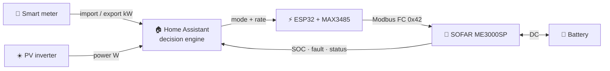

```text
░█▀▀░█▀█░█▀▀░█▀█░█▀▄░░░█▄█░█▀▀░▀▀█░█▀█░█▀█░█▀█░█▀▀░█▀█
░▀▀█░█░█░█▀▀░█▀█░█▀▄░░░█░█░█▀▀░░▀▄░█░█░█░█░█░█░▀▀█░█▀▀
░▀▀▀░▀▀▀░▀░░░▀░▀░▀░▀░░░▀░▀░▀▀▀░▀▀░░▀▀▀░▀▀▀░▀▀▀░▀▀▀░▀░░
```

# SOFAR ME3000SP Controller

> **HACS custom integration for smart battery inverter control** — driven by
> external truth sources (smart meter + PV), not the SOFAR's internal CT clamps.

[](CHANGELOG.md)
[](https://hacs.xyz/)
[](https://www.home-assistant.io/)
[](docs/ARCHITECTUUR.md)
[](LICENSE)

**Signal path:** smart meter + PV → Home Assistant decides → ESP32 + MAX3485 →
Modbus RS485 → SOFAR ME3000SP acts. The inverter is treated as a dumb actuator;
the intelligence lives in Home Assistant, where you can see it, tune it, and
trust it.

---

## Contents

- [Who is this for?](#who-is-this-for)
- [How it works](#how-it-works)
- [Install via HACS (recommended)](#install-via-hacs-recommended)
- [Install without HACS](#install-without-hacs)
- [ESPHome firmware](#esphome-firmware)
- [Strategies](#strategies)
- [Quarter-peak tracking (capacity tariff)](#quarter-peak-tracking-capacity-tariff)
- [What the automation does](#what-the-automation-does)
- [Tuning](#tuning)
- [Manual control services](#manual-control-services)
- [Dashboards](#dashboards)
- [Blueprint automations](#blueprint-automations)
- [Repository map](#repository-map)
- [Requirements](#requirements)
- [Safety checklist](#safety-checklist)
- [Troubleshooting · Architecture · Changelog](#troubleshooting--architecture--changelog)
- [License](#license)

---

## Who is this for?

Anyone with a **SOFAR ME3000SP** battery inverter who wants Home Assistant in
charge — without trusting the SOFAR's internal CT clamp measurements.

This integration uses:

- your **smart meter** import/export as the single source of truth
- your **PV inverter** (SMA or any other) as the PV source
- the **SOFAR** purely as an actuator: charge / discharge / auto / standby

> ⚠️ **Why not the internal SOFAR measurements?** In some installations the CT
> clamps are unreliable or were deliberately repositioned by the installer.
> This integration sidesteps that entirely by using external, verifiable sources.

---

## How it works




**Flow of information:**

1. The **smart meter** reports real-time import/export in kW
2. The **PV inverter** reports real-time production in W
3. **Home Assistant** combines both and decides: charge / discharge / auto / standby
4. The **ESP32 + MAX3485** translates that into Modbus RTU commands
5. The **SOFAR ME3000SP** executes and drives the battery
6. SOC, fault and status flow back into Home Assistant

The automation engine is the **single source of truth**: every decision, hold
timer, and quarter-peak calculation is made in one place and *reported* by the
sensors — the reason you see is always the reason that was used.

---

## Install via HACS (recommended)

No YAML knowledge required.

1. Make sure [HACS](https://hacs.xyz/) is installed
2. **HACS → Integrations → ⋮ → Custom repositories**, add:
   ```
   https://github.com/2technology/sofar-me3000sp-homeassistant
   ```
   type: **Integration**
3. Search **SOFAR ME3000SP Controller** → **Download**
4. Restart Home Assistant
5. **Settings → Devices & Services → Add Integration** → search "SOFAR ME3000SP"
6. The wizard asks you to pick your entities:

| Field | What to select | Example |
|---|---|---|
| Export entity | Smart meter export (kW) | `sensor.electricity_meter_energy_production` |
| Import entity | Smart meter import (kW) | `sensor.electricity_meter_energy_consumption` |
| PV power entity | PV inverter power (W) | `sensor.sunny_pv_power` |
| SOFAR mode select | ESPHome mode dropdown | `select.sofar_me3000sp_..._mode` |
| SOFAR charge rate | ESPHome charge rate number | `number.sofar_me3000sp_..._charge_rate` |
| SOFAR discharge rate | ESPHome discharge rate number | `number.sofar_me3000sp_..._discharge_rate` |
| SOFAR battery SOC | ESPHome SOC sensor | `sensor.sofar_me3000sp_..._battery_soc` |
| SOFAR fault messages | ESPHome fault sensor | `sensor.sofar_me3000sp_..._fault_messages` |

> 💡 Picked the wrong entity? **Settings → Devices & Services → SOFAR ME3000SP
> → Configure** lets you change entities without reinstalling.

**The integration creates:**

- **16 sensors** — derived energy flows, decision reason, strategy status, monthly peak, and 4 live quarter-peak sensors
- **7 binary sensors** — charging, discharging, exporting, importing, balanced, alarm, **peak risk**
- **14 tunable thresholds** — all persistent across restarts
- **1 strategy selector** — persistent across restarts
- built-in automation logic + **3 services** for manual control

---

## Install without HACS

<details>
<summary><b>Option A — manual custom integration</b></summary>

1. Download this repo
2. Copy `custom_components/sofar_me3000sp/` to `/config/custom_components/sofar_me3000sp/`
3. Restart Home Assistant
4. **Settings → Devices & Services → Add Integration** → "SOFAR ME3000SP"

</details>

<details>
<summary><b>Option B — YAML package (no custom integration)</b></summary>

1. Copy `home-assistant/packages/sofar_me3000sp.yaml` to `/config/packages/`
2. Add to `configuration.yaml`:
   ```yaml
   homeassistant:
     packages: !include_dir_named packages
   ```
3. Restart Home Assistant

> ⚠️ With the YAML package you must rename entities manually if yours differ
> from the defaults. The HACS integration handles this via the UI wizard.

</details>

---

## ESPHome firmware

The SOFAR needs an ESP32 + MAX3485 RS485 module to accept write commands.


<details>
<summary>Text version (copy/paste)</summary>

```text
ESP32               MAX3485            SOFAR 485s
GPIO16 (RX)  <----  RO
GPIO17 (TX)  ---->  DI
GPIO4        ---->  DE + RE (tied together)
3.3V         ---->  VCC
GND          ---->  GND
                     A  ------------>  A (485s port)
                     B  ------------>  B (485s port)
```

</details>

> ⚡ **GPIO4** drives both **DE** and **RE** — the MAX3485 switches between
> transmit and receive automatically.
> 🔌 Use a **3.3 V MAX3485 module**. A 5 V module can damage the ESP32.

**Flashing:**

1. Open ESPHome and import `esphome/sofar-me3000sp-esp32.yaml`
2. Copy `esphome/secrets.yaml.example` to `esphome/secrets.yaml` and fill in
   your Wi-Fi credentials, API encryption key, and OTA password
3. Flash via USB the first time, OTA afterwards

> ⚠️ **Required: Passive Mode.** The ME3000SP only accepts write commands in
> Passive Mode. Set it via the display menu: `Settings → Work Mode → Passive`.

---

## Strategies

Pick one via **Settings → Devices & Services → SOFAR → Strategy**, or from the
Control Center dashboard. The selection survives restarts.

| Strategy | When | Behaviour |
|---|---|---|
| **Self-consumption** | Default, plenty of PV | Charge on surplus, discharge on import, back to auto on balance |
| **Peak shaving** | Capacity tariff regions | Controls the **projected quarter-hour average** — see below |
| **Night save** | No PV overnight | **Standby** during night hours (default 22:00–06:00): battery is preserved for the morning; charging on surplus stays allowed. Self-consumption during the day |
| **Force charge** | Manual override | Charge unconditionally at the configured rate |
| **Force discharge** | Manual override | Discharge unconditionally down to minimum SOC |
| **Auto** | Holiday / hands-off | The SOFAR runs its own firmware logic |

**Priority chain** (evaluated before any strategy):
`ALARM → standby` › `SOC critical → force charge` › *selected strategy* ›
hold timers (5–10 min anti-flapping) › rate throttle (≥ 60 s, ≥ 200 W delta).

---

## Quarter-peak tracking (capacity tariff)

Grid operators with a capacity tariff (e.g. **Fluvius** in Flanders) bill on the
highest average import power per **clock quarter** (:00 / :15 / :30 / :45) of
the month. A 30-second spike is irrelevant; a quietly elevated quarter is not.

The integration runs a clock-aligned, time-weighted quarter tracker, and the
**peak shaving strategy controls the projection**, not the instantaneous power:

```text
P_projected = ( E_so_far + P_now × t_remaining ) / 900

discharge   = P_now − budget      where  budget = ( threshold × 900 − E_so_far ) / t_remaining
```

The battery discharges *exactly* enough to land the quarter on the threshold —
no panic discharge on spikes, no missed creeping overruns, minimal battery wear.

| Entity | Answers |
|---|---|
| `sensor.sofar_quarter_time_remaining` | How long does the running measurement still count? (+ end time, mm:ss) |
| `sensor.sofar_quarter_avg_w` | Time-weighted average of the current quarter so far |
| `sensor.sofar_quarter_projected_w` | Where does this quarter land if current power holds? |
| `sensor.sofar_quarter_budget_w` | How much can I still draw without breaching the threshold? |
| `sensor.sofar_monthly_peak_w` | Highest closed quarter this month — persistent, monthly rollover |
| `binary_sensor.sofar_peak_risk` | Is this quarter about to raise my monthly peak? → notification trigger |

`sensor.sofar_decision_reason` explains every decision in plain language and
carries machine-readable attributes (`strategy`, `active_hold`,
`hold_remaining_s`, quarter data) for dashboards and automations.

---

## What the automation does

| Situation | Action |
|---|---|
| Real export > threshold + PV high + SOC < max | **Charge**, rate follows the smoothed surplus |
| Real import > threshold + SOC > min | **Discharge**, rate follows the smoothed deficit |
| Projected quarter average > peak threshold *(peak shaving)* | **Discharge** exactly enough to hold the projection at the threshold |
| Net flow near zero | **Auto** (neutral baseline) |
| SOC below critical level | **Force charge** until target SOC |
| Alarm / fault | **Standby**, always, regardless of strategy |

**Properties:** variable power (never constant), hysteresis via hold timers,
per-direction rate throttling, mode writes only on change (no Modbus spam),
safety first, CT clamps ignored.

---

## Tuning

14 thresholds, adjustable via the UI, persistent across restarts:

| Helper | Default | Purpose |
|---|---:|---|
| Export Start W | 400 W | When does charging start? |
| Import Start W | 300 W | When does discharging start? |
| PV Min W | 700 W | Minimum PV before charging |
| Balance W | 150 W | When is the flow "balanced"? |
| Charge Margin W | 150 W | Safety margin while charging |
| Discharge Margin W | 250 W | Safety margin while discharging |
| SOC Max Charge | 95 % | Stop charging above this |
| SOC Min Discharge | 35 % | Stop discharging below this |
| SOC Force Charge | 20 % | Force charge starts below this |
| SOC Force Charge Target | 50 % | Force charge stops above this |
| Force Charge Rate | 1500 W | Power during force charge |
| Peak Threshold W | 2500 W | Quarter-average ceiling for peak shaving |
| Night Start Hour | 22 | Night save window start |
| Night End Hour | 6 | Night save window end |

> Defaults are conservative. Observe a few days before tuning.
> Different PV inverter or smart meter? See [`docs/AANPASSEN.md`](docs/AANPASSEN.md).

---

## Manual control services

Available via **Developer Tools → Services**:

```yaml
service: sofar_me3000sp.set_mode
data:
  mode: "auto"        # auto · charge · discharge · standby
```

```yaml
service: sofar_me3000sp.set_charge_rate
data:
  rate: 1500          # 0–3000 W
```

```yaml
service: sofar_me3000sp.set_discharge_rate
data:
  rate: 1500          # 0–3000 W
```

---

## Dashboards

Four Lovelace views under `home-assistant/dashboards/`:

| Dashboard | Purpose | Needs |
|---|---|---|
| `..._control_center.yaml` | **Control Center** — strategy selector, peak tracking, decision logic, all settings in one place | Mushroom Cards |
| `..._live_decision.yaml` | Real-time mode, decision reason, energy flow chips, SOC gauge, rate sliders | Mushroom Cards, card-mod optional |
| `..._wall_panel.yaml` | Polished wall panel | Mushroom Cards, card-mod optional |
| `..._mushroom_basic.yaml` | Compact card set | Mushroom Cards |

Add via **Edit dashboard → Add card → Manual** and paste from
`type: vertical-stack` (skip the wrapper key). Without card-mod the colour
accents disappear but everything stays functional.

> The dashboards target the **HACS integration** entity names. With the YAML
> package, match the names manually.

---

## Blueprint automations

Six UI-configurable blueprints in `blueprints/automation/` — optional, since
the integration has all automation built in, but handy for fine-tuning rules
without touching code:

| Blueprint | Does |
|---|---|
| Charge on Export Surplus | Charge on real export + sufficient PV |
| Discharge on Import Deficit | Discharge on real import |
| Return to Auto on Grid Balance | Back to auto when balanced |
| Baseline Auto at Sunrise | Reset to auto at sunrise |
| Alarm Emergency Stop | Standby + notification on fault |
| Force Charge on Critical Low SOC | Emergency charge at critical SOC |

Copy them to `/config/blueprints/automation/` or import via the `source_url`
in each file, then **Settings → Automations & Scenes → Blueprints**.

---

## Repository map

| Path | Purpose |
|---|---|
| `custom_components/sofar_me3000sp/` | **The HACS integration** — config flow, automation engine, entities, services |
| `esphome/sofar-me3000sp-esp32.yaml` | ESP32/MAX3485 firmware — Modbus FC 0x42 passive-mode control |
| `esphome/secrets.yaml.example` | Secrets template (real secrets are gitignored) |
| `blueprints/automation/` | 6 UI-configurable blueprints |
| `home-assistant/dashboards/` | 4 Lovelace dashboards |
| `home-assistant/packages/` | YAML package alternative + standalone template sensors |
| `docs/` | Installation · Architecture · Customisation · Troubleshooting *(Dutch, translations welcome)* |
| `assets/` | Architecture photo + wiring diagram |
| `CHANGELOG.md` | Per-version history |

---

## Requirements

**Hardware**
- SOFAR ME3000SP in **Passive Mode**
- ESP32 dev board
- MAX3485 RS485 module (**3.3 V**, with DE/RE flow control)
- Smart meter integrated in Home Assistant
- PV inverter integrated in Home Assistant

**Software**
- Home Assistant **2024.2.0** or newer
- ESPHome (add-on or standalone)
- For the dashboards: HACS + Mushroom Cards, card-mod optional

---

## Safety checklist

- [ ] SOFAR is in **Passive Mode** (display menu)
- [ ] MAX3485 A/B correctly wired to the 485s port
- [ ] ESPHome entity names match what you selected in the wizard
- [ ] Home Assistant config check is green before restarting
- [ ] SOC and fault sensors are available (not `unavailable`)

---

## Troubleshooting · Architecture · Changelog

- [`docs/TROUBLESHOOTING.md`](docs/TROUBLESHOOTING.md) — sensors unavailable, Modbus CRC errors, mode not changing, and more
- [`docs/ARCHITECTUUR.md`](docs/ARCHITECTUUR.md) — the control strategy in depth
- [`CHANGELOG.md`](CHANGELOG.md) — including the full v2.2.0 rework of the decision engine and quarter-peak tracker

---

## License

MIT — free to use, modify, and share.

```text
░█▄█░█▀█░█▀▄░░░█▀▀░█▀▀░▀█▀░█▀▀░█▀█░█▀▀░█▀▀░░░█░░░█▀█░█▀▄
░█░█░█▀█░█░█░░░▀▀█░█░░░░█░░█▀▀░█░█░█░░░█▀▀░░░█░░░█▀█░█▀▄
░▀░▀░▀░▀░▀▀░░░░▀▀▀░▀▀▀░▀▀▀░▀▀▀░▀░▀░▀▀▀░▀▀▀░░░▀▀▀░▀░▀░▀▀░
```
*"Measured, not guessed."*
