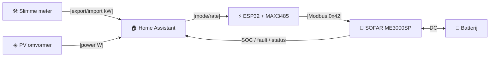

# SOFAR ME3000SP Controller

> **HACS-compatible Home Assistant integratie voor slimme batterij-aansturing**
> Gebaseerd op externe meetbronnen (slimme meter + PV), niet op interne Sofar CT-klemmen.

[](#)
[](#)
[](#)

```text
   ____  ___  _________ _______________  ________  __  _______  ____  __________  ___ 
  / __ \/ _ \/ ___/ __ \/ ___/ ___/ _ \/ __/ __ \/  |/  / __ \/ __ \/_  __/ _ \/ _ |
 / /_/ / , _/ /__/ /_/ / /__/ /__/ , _/ _// /_/ / /|_/ / /_/ / /_/ / / / / , _/ __ |
 \____/ /|_|\___/\____/\___/\___/ /|_|/___/\____/_/  /_/\____/\____/ /_/  /|_|/_/|_|
                                                                                       
```

> **Mad Science Lab SOFAR ME3000SP Controller**  
> Externe-bron-sturing van je batterij-omvormer. Betrouwbaar, tunebaar, visueel.

---

## 📑 Inhoud

- [Voor wie is dit?](#voor-wie-is-dit)
- [Hoe werkt het?](#hoe-werkt-het)
- [Installatie via HACS (aanbevolen)](#installatie-via-hacs-aanbevolen)
- [Installatie zonder HACS](#installatie-zonder-hacs)
- [ESPHome firmware flashen](#esphome-firmware-flashen)
- [Dashboard toevoegen](#dashboard-toevoegen)
- [Wat doet de automatie?](#wat-doet-de-automatie)
- [Tuning en aanpassen](#tuning-en-aanpassen)
- [Services voor handmatige controle](#services-voor-handmatige-controle)
- [Alle bestanden in deze repo](#alle-bestanden-in-deze-repo)
- [Vereisten](#vereisten)
- [Veiligheid](#veiligheid)
- [Troubleshooting](#troubleshooting)
- [Architectuur](#architectuur)
- [Changelog](#changelog)
- [Licentie](#licentie)

---

## Voor wie is dit?

Voor iedereen die een **SOFAR ME3000SP** batterijomvormer heeft en deze via Home Assistant slim wil aansturen — zonder te vertrouwen op de interne CT-klem-metingen van de Sofar.

Deze integratie gebruikt:

- **slimme meter** export/import als waarheid
- **PV-omvormer** (SMA of andere) als PV-bron
- **SOFAR** alleen als actuator (laden/ontladen/standby)

> ⚠️ Waarom niet de interne Sofar-metingen? In sommige installaties zijn de CT-klemmen onbetrouwbaar of bewust aangepast door de installateur. Deze integratie omzeilt dat probleem volledig door externe, verifieerbare bronnen te gebruiken.

---

## Hoe werkt het?

Home Assistant beslist op basis van je slimme meter en PV-opbrengst, en stuurt de SOFAR via ESPHome aan als een remote-gecontroleerde actuator.

### Schematische opstelling



Dit is de fysieke opstelling in mijn woning:


**Stroom van informatie:**

1. **Slimme meter** meldt realtime export/import in kW
2. **PV omvormer** meldt realtime PV-productie in W
3. **Home Assistant** combineret beide en beslist: charge / discharge / auto / standby
4. **ESP32 + MAX3485** zet dat om naar Modbus RTU commands
5. **SOFAR ME3000SP** voert het commando uit en stuurt batterij aan
6. **Batterij** stuurt SOC, fault en status terug naar Home Assistant

### Componenten

| Component | Rol |
|---|---|
| **Slimme meter** | De waarheid over import/export |
| **PV omvormer** | De bron van de actuele PV-opbrengst |
| **Home Assistant** | Het brein: leest slimme meter + PV, beslist, stuurt de SOFAR |
| **ESP32 + MAX3485** | De brug tussen HA en de SOFAR via Modbus RS485 |
| **SOFAR ME3000SP** | De actuator: laadt/ontlaadt de batterij op commando |
| **Batterij** | Energiebuffer die via de SOFAR wordt aangestuurd |

---

## Installatie via HACS (aanbevolen)

De makkelijkste manier — geen YAML-kennis nodig.

### Stap 1: HACS installeren
Zorg dat [HACS](https://hacs.xyz/) geïnstalleerd is in Home Assistant.

### Stap 2: Repository toevoegen
1. Ga naar **HACS → Integrations**
2. Klik rechtsboven op **⋮ → Custom repositories**
3. Voeg deze URL toe:
   ```
   http://192.168.1.80:3000/Mad_Science_Lab/sofar-me3000sp-homeassistant
   ```
4. Kies type: **Integration**
5. Klik **Add**

### Stap 3: Downloaden
1. Zoek **SOFAR ME3000SP Controller** in HACS
2. Klik **Download**
3. Wacht tot de download klaar is

### Stap 4: Herstarten
Herstart Home Assistant.

### Stap 5: Integratie toevoegen
1. Ga naar **Settings → Devices & Services**
2. Klik **Add Integration** (rechtsonder)
3. Zoek op **"SOFAR ME3000SP"**
4. Volg de wizard:

De wizard vraagt je om deze entities te selecteren:

| Veld | Wat vul je in? | Voorbeeld |
|---|---|---|
| Export entity | Slimme meter export (kW) | `sensor.electricity_meter_energieproductie` |
| Import entity | Slimme meter import (kW) | `sensor.electricity_meter_energieverbruik` |
| PV power entity | PV-omvormer power (W) | `sensor.sunny_pv_power` |
| SOFAR mode select | ESPHome mode dropdown | `select.sofar_me3000sp_sofar_me3000sp_mode` |
| SOFAR charge rate | ESPHome charge rate slider | `number.sofar_me3000sp_sofar_me3000sp_charge_rate` |
| SOFAR discharge rate | ESPHome discharge rate slider | `number.sofar_me3000sp_sofar_me3000sp_discharge_rate` |
| SOFAR battery SOC | ESPHome SOC sensor | `sensor.sofar_me3000sp_sofar_me3000sp_battery_soc` |
| SOFAR fault messages | ESPHome fault sensor | `sensor.sofar_me3000sp_sofar_me3000sp_fault_messages` |

### Stap 6: Klaar!
De integratie maakt automatisch aan:
- **9 sensors** (export, import, netto, surplus, deficit, huislast, PV, flow direction, visual summary)
- **6 binary sensors** (charging, discharging, exporting, importing, balanced, alarm)
- **8 tunable drempels** (export start, import start, PV min, balance, margins, SOC limits)
- **Interne automation logica** (charge/discharge/auto/standby/force-charge)
- **3 services** (set_mode, set_charge_rate, set_discharge_rate)

---

## Installatie zonder HACS

### Optie A: Handmatige custom integration
1. Download deze repo
2. Kopieer de map `custom_components/sofar_me3000sp/` naar:
   ```
   /config/custom_components/sofar_me3000sp/
   ```
3. Herstart Home Assistant
4. Ga naar **Settings → Devices & Services → Add Integration** → "SOFAR ME3000SP"

### Optie B: YAML package (geen custom integration)
Als je liever geen custom integration gebruikt:

1. Kopieer `home-assistant/packages/sofar_me3000sp.yaml` naar:
   ```
   /config/packages/sofar_me3000sp.yaml
   ```
2. Voeg aan `configuration.yaml` toe:
   ```yaml
   homeassistant:
     packages: !include_dir_named packages
   ```
3. Herstart Home Assistant

> ⚠️ Bij de YAML package moet je entity-namen handmatig aanpassen als ze anders heten dan de defaults. Bij de HACS integratie doe je dat via de UI-wizard.

---

## ESPHome firmware flashen

De SOFAR heeft een ESP32 + MAX3485 RS485-module nodig om write-commands te ontvangen.

### Hardware aansluiten

```text
ESP32              MAX3485           SOFAR 485s
GPIO16 (RX)  ----> RO
GPIO17 (TX)  ----> DI
GPIO5        ----> DE + RE (samen)
3.3V         ----> VCC
GND          ----> GND
                    A  ------------>  A (485s poort)
                    B  ------------>  B (485s poort)
```

### Firmware flashen

1. Open ESPHome
2. Maak een nieuw device of importeer `esphome/sofar-me3000sp-esp32.yaml`
3. Kopieer `esphome/secrets.yaml.example` naar `esphome/secrets.yaml` en vul in:
   ```yaml
   wifi_ssid: "JOUW_WIFI"
   wifi_password: "JOUW_WACHTWOORD"
   api_encryption_key: "GENEREER_IN_ESPHOME"
   ota_password: "KIES_EEN_WACHTWOORD"
   fallback_ap_password: "KIES_EEN_WACHTWOORD"
   ```
4. Flash via USB (eerste keer), daarna via OTA

### ⚠️ Vereiste: Passive Mode
De ME3000SP **moet in Passive Mode staan** om write-commands te accepteren.
Zet dit via het display-menu: `Settings → Work Mode → Passive`

---

## Dashboard toevoegen

Er zijn twee dashboard-varianten beschikbaar:

### Wall Panel (mooie versie)
```text
home-assistant/dashboards/sofar_me3000sp_wall_panel.yaml
```

Vereist:
- [HACS](https://hacs.xyz/)
- [Mushroom Cards](https://github.com/piitaya/lovelace-mushroom)
- Optioneel: [card-mod](https://github.com/thomasloven/lovelace-card-mod) (voor kleuraccenten)

> **Belangrijk:** de dashboards zijn ontworpen voor de **HACS custom integration**. Gebruik je de YAML package, dan moet je de sensor- en helper-namen handmatig matchen.

**Hoe toe te voegen:**
1. Open je dashboard
2. Kies **Edit dashboard → Add card → Manual**
3. Plak de inhoud vanaf `type: vertical-stack` (niet de `wall_panel:` wrapper)

> Zonder card-mod werken de kleurranden en glow niet, maar de kaart blijft functioneel.

### Mushroom Basic (eenvoudiger)
```text
home-assistant/dashboards/sofar_me3000sp_mushroom_basic.yaml
```
Vereist alleen Mushroom Cards.

---

## Wat doet de automatie?

| Situatie | Actie |
|---|---|
| Echte export > drempel + PV hoog + SOC < max | **Charge** met variabel vermogen op basis van surplus |
| Echte import > drempel + SOC > min | **Discharge** met variabel vermogen op basis van deficit |
| Netflow bijna nul | **Auto** (neutrale baseline) |
| SOC < 20% (kritisch) | **Force charge** op 1500W tot 50% bereikt |
| Alarm/fault | **Standby** + notificatie |
| Zonsopgang | **Auto** (baseline reset) |

### Belangrijke eigenschappen
- **Variabel vermogen**: niet constant, maar dynamisch aangepast aan de actuele energieflow
- **Hysterese**: 5 minuten stabiliteit vereist vóór schakelen (10 min voor balans)
- **Veiligheid eerst**: alarm → standby, lage SOC → force charge
- **CT-klemmen genegeerd**: alle beslissingen op basis van slimme meter + PV

---

## Tuning en aanpassen

Na installatie krijg je 8 tunable drempels die je via de UI kunt aanpassen:

| Helper | Default | Doel |
|---|---:|---|
| Export Start W | 400 W | Wanneer start laden? |
| Import Start W | 300 W | Wanneer start ontladen? |
| PV Min W | 700 W | Minimale PV voor laden |
| Balance W | 150 W | Wanneer is flow "in balans"? |
| Charge Margin W | 150 W | Veiligheidsmarge bij laden |
| Discharge Margin W | 250 W | Veiligheidsmarge bij ontladen |
| SOC Max Charge | 95 % | Stop laden boven dit % |
| SOC Min Discharge | 35 % | Stop ontladen onder dit % |

> Startwaarden zijn conservatief. Pas ze pas aan na een paar dagen observatie.

### Andere PV-omvormer of slimme meter?
Zie [`docs/AANPASSEN.md`](docs/AANPASSEN.md) voor entity-naam aanpassingen.

---

## Services voor handmatige controle

De integratie registreert 3 services die je via **Developer Tools → Services** kunt aanroepen:

### `sofar_me3000sp.set_mode`
Stel de inverter mode handmatig in.
```yaml
service: sofar_me3000sp.set_mode
data:
  mode: "auto"  # auto, charge, discharge of standby
```

### `sofar_me3000sp.set_charge_rate`
Stel het laadvermogen in (0-3000W).
```yaml
service: sofar_me3000sp.set_charge_rate
data:
  rate: 1500
```

### `sofar_me3000sp.set_discharge_rate`
Stel het ontlaadvermogen in (0-3000W).
```yaml
service: sofar_me3000sp.set_discharge_rate
data:
  rate: 1500
```

---

## Alle bestanden in deze repo

| Bestand | Doel |
|---|---|
| `custom_components/sofar_me3000sp/` | **HACS custom integration** — UI-wizard, sensors, automations, services |
| `home-assistant/packages/sofar_me3000sp.yaml` | Alternatief: drop-in YAML package (zonder custom integration) |
| `home-assistant/packages/sofar_me3000sp_template_sensors_only.yaml` | Compacte template-sensors alleen (zonder automations) |
| `home-assistant/dashboards/sofar_me3000sp_wall_panel.yaml` | Mooie wall-panel dashboardkaart (Mushroom + card-mod) |
| `home-assistant/dashboards/sofar_me3000sp_mushroom_basic.yaml` | Eenvoudigere Mushroom dashboardkaart |
| `esphome/sofar-me3000sp-esp32.yaml` | ESP32/MAX3485 firmware voor SOFAR control |
| `esphome/secrets.yaml.example` | Voorbeeld secrets (kopieer naar secrets.yaml) |
| `docs/INSTALLATIE.md` | Stap-voor-stap installatie voor beginners |
| `docs/TROUBLESHOOTING.md` | Uitgebreide foutzoekgids |
| `docs/ARCHITECTUUR.md` | Uitleg van de regelstrategie |
| `docs/AANPASSEN.md` | Hoe pas je dit aan voor jouw setup? |
| `CHANGELOG.md` | Wat is er veranderd per versie? |
| `hacs.json` | HACS metadata |

---

## Vereisten

### Hardware
- SOFAR ME3000SP in **Passive Mode**
- ESP32 dev board
- MAX3485 RS485-module (3.3V, rood board, met DE/RE flow-control)
- Slimme meter met Home Assistant integratie
- PV-omvormer met Home Assistant integratie

### Software
- Home Assistant 2024.1.0 of nieuwer
- ESPHome add-on of losse installatie
- Voor het dashboard: HACS + Mushroom Cards
- Optioneel: card-mod voor extra kleuraccenten

### Home Assistant bronentities
Deze moeten bij jou bestaan:

```text
sensor.electricity_meter_energieproductie   # export in kW
sensor.electricity_meter_energieverbruik     # import in kW
sensor.sunny_pv_power                        # PV power in W
```

> Als jouw entity-namen anders zijn: bij de HACS integratie kies je ze via de wizard. Bij de YAML package pas je ze aan met zoeken-en-vervangen.

---

## Veiligheid

Controleer altijd vóór gebruik:

- [ ] SOFAR staat in **Passive Mode** (via display-menu)
- [ ] MAX3485 A/B correct aangesloten op de 485s-poort
- [ ] ESPHome entity-namen komen overeen met wat je in de wizard invult
- [ ] Home Assistant config check is groen vóór herstart
- [ ] Batterij SOC en fault sensors zijn beschikbaar (niet `unavailable`)

---

## Troubleshooting

Zie [`docs/TROUBLESHOOTING.md`](docs/TROUBLESHOOTING.md) voor uitgebreide foutzoeking, inclusief:

- Package laadt niet
- Sensors blijven unavailable
- Automations schakelen niet
- ESPHome kan geen verbinding maken met SOFAR
- Modbus CRC errors
- Batterij laadt/ontlaadt niet
- Mode verandert niet in HA
- Andere PV-omvormer of slimme meter

---

## Architectuur

Zie [`docs/ARCHITECTUUR.md`](docs/ARCHITECTUUR.md) voor de volledige uitleg van de regelstrategie.

**Kernprincipe:** De SOFAR ME3000SP wordt behandeld als actuator. Home Assistant beslist op basis van externe, betrouwbare metingen.

---

## Changelog

Zie [`CHANGELOG.md`](CHANGELOG.md) voor alle wijzigingen per versie.

---

## Licentie

MIT — vrij te gebruiken, aanpassen en delen.