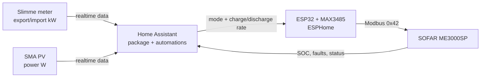

# SOFAR ME3000SP Home Assistant Toolkit

Gebruiksklare Home Assistant + ESPHome toolkit voor de SOFAR ME3000SP met ESP32 + MAX3485 RS485-sturing.

## Voor wie is dit?

Voor gebruikers die hun SOFAR ME3000SP via Home Assistant willen aansturen zonder te vertrouwen op de interne Sofar CT/powerflow-metingen.

Deze repo gebruikt:

- slimme meter export/import als waarheid
- SMA PV-opbrengst als PV-bron
- SOFAR alleen als actuator

## Hoe werkt het?



## Snelstart

1. Flash de ESP32 met:

```text
esphome/sofar-me3000sp-esp32.yaml
```

2. Installeer de Home Assistant package:

```text
home-assistant/packages/sofar_me3000sp.yaml
```

naar:

```text
/config/packages/sofar_me3000sp.yaml
```

3. Voeg aan `configuration.yaml` toe:

```yaml
homeassistant:
  packages: !include_dir_named packages
```

4. Herstart Home Assistant.

5. Voeg het dashboard toe uit:

```text
home-assistant/dashboards/sofar_me3000sp_wall_panel.yaml
```

## Belangrijkste bestanden

| Bestand | Doel |
|---|---|
| `home-assistant/packages/sofar_me3000sp.yaml` | Complete drop-in package: sensors, helpers, automations |
| `home-assistant/dashboards/sofar_me3000sp_wall_panel.yaml` | Mooie wall-panel dashboardkaart |
| `home-assistant/dashboards/sofar_me3000sp_mushroom_basic.yaml` | Eenvoudigere Mushroom dashboardkaart |
| `esphome/sofar-me3000sp-esp32.yaml` | ESP32/MAX3485 firmware voor SOFAR control |
| `esphome/secrets.yaml.example` | Voorbeeld secrets (kopieer naar secrets.yaml) |
| `docs/INSTALLATIE.md` | Stap-voor-stap installatie voor beginners |
| `docs/TROUBLESHOOTING.md` | Uitgebreide foutzoekgids |
| `docs/ARCHITECTUUR.md` | Uitleg van de regelstrategie |
| `docs/AANPASSEN.md` | Hoe pas je dit aan voor jouw setup? |
| `CHANGELOG.md` | Wat is er veranderd per versie? |

## Verwachte Home Assistant bronentities

Deze moeten bij jou al bestaan of aangepast worden in de YAML:

```text
sensor.electricity_meter_energieproductie   # export in kW
sensor.electricity_meter_energieverbruik     # import in kW
sensor.sunny_pv_power                        # PV power in W
```

## Wat doet de automation?

- Bij echte export: batterij laden met variabel vermogen
- Bij echte import: batterij ontladen met variabel vermogen
- Bij balans: terug naar auto
- Bij alarm: standby
- CT-klemwaarden van de Sofar worden genegeerd

## Installatie

Lees eerst:

```text
docs/INSTALLATIE.md
```

## Dashboard

Voor de mooiste kaart heb je nodig:

- HACS
- Mushroom Cards
- optioneel card-mod

## Veiligheid

Controleer altijd:

- SOFAR staat in Passive Mode
- MAX3485 A/B correct aangesloten
- ESPHome entity-namen komen overeen
- Home Assistant config check is groen vóór herstart

## Licentie

MIT
