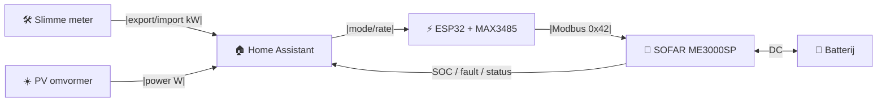

# Architectuur

## Principe

De SOFAR ME3000SP wordt **uitsluitend als actuator** behandeld.  
Home Assistant beslist op basis van externe, betrouwbare metingen en stuurt de omvormer via ESPHome aan.

## Schematische dataflow

## Dataflow in woorden

1. **Slimme meter** stuurt realtime export/import in kW naar Home Assistant.
2. **PV-omvormer** stuurt realtime PV-productie in W naar Home Assistant.
3. **Home Assistant** bepaalt de optimale modus:
   - `charge` — er is meer export dan nodig, batterij opladen
   - `discharge` — er is import, batterij bijvullen van huisverbruik
   - `auto` — neutrale toestand, laat SOFAR zelf balanceren
   - `standby` — alarm of veiligheidsstop
4. **ESP32 + MAX3485** zet de modus en rate om naar Modbus RTU-commands (Modbus ID `0x42`).
5. **SOFAR ME3000SP** voert het commando uit en regelt de DC-verbinding met de batterij.
6. **Batterij** stuurt SOC, fault en status terug naar Home Assistant via de SOFAR.

## Niet gebruikt voor beslissingen

- interne Sofar PV/load-metingen
- CT-klem powerflow
- `battery_save`-logica

## Wel gebruikt

- `sensor.electricity_meter_energieproductie` (slimme meter export)
- `sensor.electricity_meter_energieverbruik` (slimme meter import)
- `sensor.sunny_pv_power` (PV-omvormer, vervang door jouw entity)
- SOFAR SOC/faults als **veiligheidsguardrails**, nooit als primaire beslissingsbron

## Modi

| Mode | Betekenis |
|---|---|
| `auto` | Neutrale baseline; SOFAR bepaalt zelf |
| `charge` | Batterij opladen met variabel vermogen gebaseerd op netto export |
| `discharge` | Batterij ontladen met variabel vermogen gebaseerd op netto import |
| `standby` | Noodstop of alarm |

## Integratievormen

Dit project levert twee integratievormen:

1. **HACS custom integration** — `custom_components/sofar_me3000sp/`  
   UI-wizard, automatische entities, interne automations, services.  
   Dit is de aanbevolen route.

2. **YAML package** — `home-assistant/packages/sofar_me3000sp.yaml`  
   Drop-in package met template sensors, helpers en automations.  
   Handig als je geen custom integration wilt of kunt installeren.

Beide gebruiken exact dezelfde externe meetbronnen en dezelfde regellogica.
