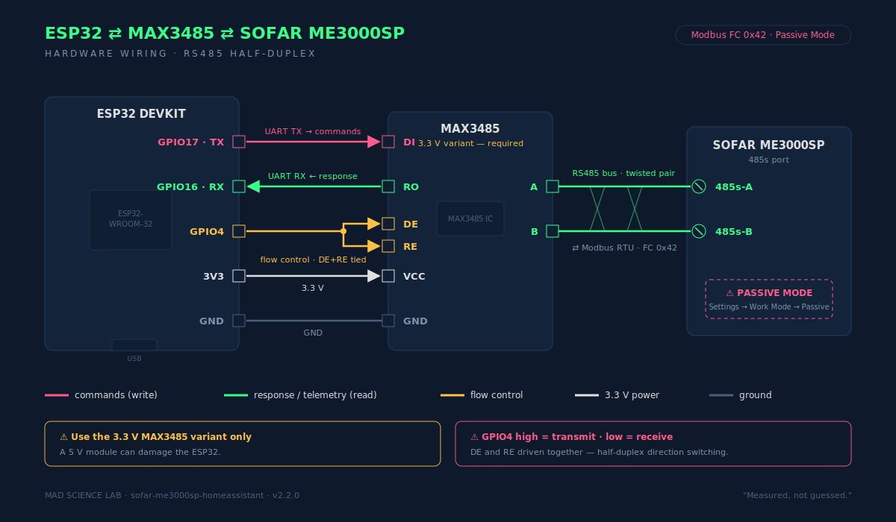

# Installatie — SOFAR ME3000SP Home Assistant

Deze gids is geschreven voor iemand die Home Assistant wel gebruikt, maar niet dagelijks YAML bewerkt.

Er zijn twee installatiepaden. **De HACS custom integration is het makkelijkst.**

---

## 1. Vereisten

### Hardware
- SOFAR ME3000SP in **Passive Mode**
- ESP32
- MAX3485 RS485-module, 3.3V, met DE/RE flow-control
- PV-omvormer met Home Assistant sensor (bijv. `sensor.sunny_pv_power`)
- slimme meter sensors:
  - `sensor.electricity_meter_energieproductie` — export in kW
  - `sensor.electricity_meter_energieverbruik` — import in kW

### Home Assistant add-ons / integraties
- [HACS](https://hacs.xyz/) (aanbevolen)
- ESPHome add-on of losse ESPHome installatie
- optioneel: HACS + Mushroom Cards voor het dashboard
- optioneel: HACS + card-mod voor extra kleuraccenten

### ⚠️ Belangrijk: entity-namen aanpassen
De package gaat uit van deze exacte entity-namen. Als jouw slimme meter of PV-omvormer andere entity-namen heeft, moet je die aanpassen.

- Bij de **HACS integratie**: doe dit in de UI-wizard tijdens de setup.
- Bij de **YAML package**: gebruik zoeken-en-vervangen in `sofar_me3000sp.yaml`.

Zie [`AANPASSEN.md`](AANPASSEN.md) voor voorbeelden.

---

## 2. ESPHome flashen

1. Open ESPHome.
2. Maak een nieuw device of importeer `esphome/sofar-me3000sp-esp32.yaml`.
3. Kopieer `esphome/secrets.yaml.example` naar `esphome/secrets.yaml` en vul in:

```yaml
wifi_ssid: "JOUW_WIFI"
wifi_password: "JOUW_WACHTWOORD"
api_encryption_key: "GENEREER_IN_ESPHOME"
ota_password: "KIES_EEN_WACHTWOORD"
fallback_ap_password: "KIES_EEN_WACHTWOORD"
```

4. Sluit de hardware aan volgens dit schema:



<details>
<summary>Tekstversie (voor copy/paste)</summary>

```text
ESP32              MAX3485           SOFAR 485s
GPIO16 (RX)  ----> RO
GPIO17 (TX)  ----> DI
GPIO5        ----> DE + RE (samen)
3.3V         ----> VCC
GND          ----> GND
                    A  ------------>  A (485s poort)
                    B  ------------>  B (485s poort)
```

</details>

- **GPIO5** drijft zowel **DE** als **RE**. Hierdoor schakelt de MAX3485 automatisch tussen TX en RX.
- Gebruik een **3.3V MAX3485-module**. Een 5V-module kan de ESP32 beschadigen.
- Kabels A/B niet omdraaien; de meeste problemen zijn A/B verwisseld of de SOFAR niet in **Passive Mode**.

5. Flash eerst via USB.
6. Daarna kan OTA.

---

## 3. Home Assistant integratie installeren

### Optie A: HACS (aanbevolen)

1. Ga naar **HACS → Integrations**
2. **⋮ → Custom repositories**
3. Voeg toe:
   ```
   https://github.com/2technology/sofar-me3000sp-homeassistant
   ```
4. Type: **Integration**
5. Klik op **SOFAR ME3000SP Controller → Download**
6. Herstart Home Assistant
7. Ga naar **Settings → Devices & Services → Add Integration**
8. Zoek op **"SOFAR ME3000SP"**
9. Volg de wizard en selecteer je entities

> 💡 **Entity gewijzigd?** Ga naar **Settings → Devices & Services → SOFAR ME3000SP → Configure** om je entities aan te passen zonder de integratie te verwijderen.

### Optie B: Handmatige custom integration

Kopieer `custom_components/sofar_me3000sp/` naar `/config/custom_components/sofar_me3000sp/`. Herstart HA. Ga daarna naar **Settings → Devices & Services → Add Integration**.

### Optie C: YAML package (geen custom integration)

1. Kopieer `home-assistant/packages/sofar_me3000sp.yaml` naar `/config/packages/sofar_me3000sp.yaml`
2. Voeg aan `configuration.yaml` toe:
   ```yaml
   homeassistant:
     packages: !include_dir_named packages
   ```
3. Herstart Home Assistant

---

## 4. (Optioneel) Blueprint automations

Naast de ingebouwde automatie zijn er 6 Blueprint automations beschikbaar die je via de UI kunt aanpassen:

1. Kopieer `blueprints/automation/*.yaml` naar `/config/blueprints/automation/`
2. Ga naar **Settings → Automations & Scenes → Blueprints**
3. Klik **Create Automation** bij de gewenste blueprint
4. Vul entities en drempels in via de UI

> 💡 Blueprints zijn optioneel. De HACS integratie heeft alle automatie al ingebouwd.

---

## 5. (Optioneel) Dashboard toevoegen

### Optie A: HACS (aanbevolen)

1. Ga naar **HACS → Integrations**
2. **⋮ → Custom repositories**
3. Voeg toe:
   ```
   https://github.com/2technology/sofar-me3000sp-homeassistant
   ```
4. Type: **Integration**
5. Klik op **SOFAR ME3000SP Controller → Download**
6. Herstart Home Assistant
7. Ga naar **Settings → Devices & Services → Add Integration**
8. Zoek op **"SOFAR ME3000SP"**
9. Volg de wizard en selecteer je entities

### Optie B: Handmatige custom integration

Kopieer `custom_components/sofar_me3000sp/` naar `/config/custom_components/sofar_me3000sp/` en herstart Home Assistant.

### Optie C: YAML package (geen custom integration)

1. Zet in `/config/configuration.yaml`:
   ```yaml
   homeassistant:
     packages: !include_dir_named packages
   ```
2. Maak `/config/packages/` aan
3. Kopieer `home-assistant/packages/sofar_me3000sp.yaml` naar `/config/packages/sofar_me3000sp.yaml`

---

## 4. Home Assistant herstarten en valideren

1. Ga naar **Developer Tools → YAML**
2. Klik **Check configuration**
3. Herstart Home Assistant
4. Controleer of de entities bestaan:
   - Ga naar **Developer Tools → States**
   - Typ `sofar` in het filterveld
   - Je zou minstens 15 entities moeten zien, waaronder:
     - `sensor.sofar_grid_export_power`
     - `sensor.sofar_grid_import_power`
     - `sensor.sofar_net_grid_power`
     - `sensor.sofar_flow_direction`
     - `binary_sensor.sofar_charging_active`
     - `number.sofar_me3000sp_export_start_w`
   - Als je er 0 ziet: check of de integratie/package correct geladen is

---

## 5. Dashboard installeren

Voor de mooie versie gebruik je:

```text
home-assistant/dashboards/sofar_me3000sp_wall_panel.yaml
```

Open je dashboard, kies **Edit dashboard → Add card → Manual** en plak de kaartconfig.  
Let op: plak de inhoud onder `wall_panel:` als kaart. Als je in de UI plakt, begin dus bij:

```yaml
type: vertical-stack
cards:
```

---

## 6. Tuning

Na installatie krijg je number-helpers:

- `number.sofar_me3000sp_export_start_w`
- `number.sofar_me3000sp_import_start_w`
- `number.sofar_me3000sp_pv_min_w`
- `number.sofar_me3000sp_balance_w`
- `number.sofar_me3000sp_charge_margin_w`
- `number.sofar_me3000sp_discharge_margin_w`
- `number.sofar_me3000sp_soc_max_charge`
- `number.sofar_me3000sp_soc_min_discharge`

Startwaarden zijn veilig/conservatief. Pas ze pas aan na een paar dagen observatie.
